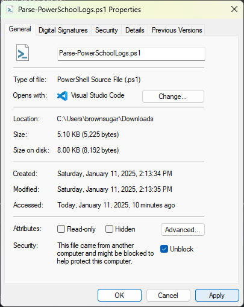

## Prerequisites

Before you begin, ensure you have the following:

- **PowerShell 5.1 or higher**: The script requires at least Windows PowerShell 5.1. (PowerShell 7+ untested at this time but it might work)
- **Log files**: A directory containing the `ps-log-audit*.log` and `mass-data*.log` files. The subfolders can be zipped or unzipped; it shouldn't matter.

## Downloading the Script

To download the `Parse-PowerSchoolLogs.ps1` script from GitHub, follow these steps:

1. **Navigate to the GitHub repository**: Open your web browser and go to the [GitHub repository](https://github.com/raijuninja/PowerSchool).

2. **Locate the script**: Find the `Parse-PowerSchoolLogs.ps1` file in the repository.

3. **Download the script**:
	- Click on the file name to open it.
	- Click the "Raw" button to view the raw file.
	- You may receive a warning that the file is potentially harmful. This is a standard warning for script files. Confirm that you want to download the file. Click `Keep` to download the script file.
	- **Unblock the file**: After downloading, right-click the file, select `Properties`, and check the `Unblock` option if it is present. This step may be necessary based on your execution policy settings. Or you could just copy the contents of my .ps1 file into your own .ps1 file - just make sure you name it the same
	

Alternatively, you can clone the entire repository using Git:

```powershell
git clone https://github.com/raijuninja/PowerSchool.git
```

This will download all the files in the repository, including `Parse-PowerSchoolLogs.ps1`.

## Usage

1. **Open PowerShell**: Ensure you are using at least Windows PowerShell 5.1.

2. **Navigate to the script directory**:
	```powershell
	cd "C:/path/to/script/"
	```

3. **Run the script**:
	```powershell
	.\Parse-PowerSchoolLogs.ps1 -LogFilePath "C:\path\to\your\logFileDirectory" -SearchStrings "UID=200A0", "/ws/md/v1/massdata/executeExport"
	```
	> **Note**: If the `-LogFilePath` parameter is not provided, the script will prompt the user to input the path to the logs directory. If the `-SearchStrings` parameter is not provided, the script will use the default search strings "UID=200A0", "/ws/md/v1/massdata/executeExport". Those defaults search for Maintenance Accounts that ran a Data Export Manager job.

4. Watch the action happen in your log directory

5. The results will be captured in a file titled `log_search_results.csv` in the root of your log folder